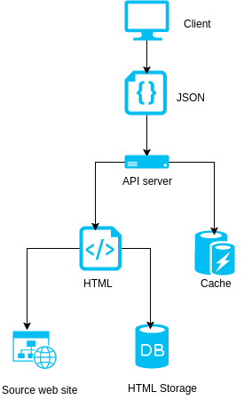
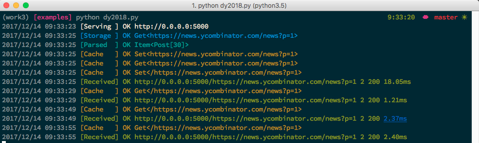
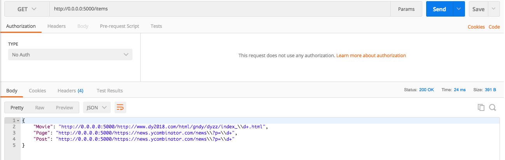
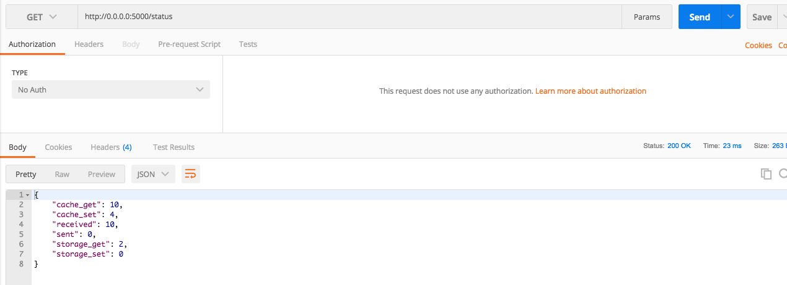
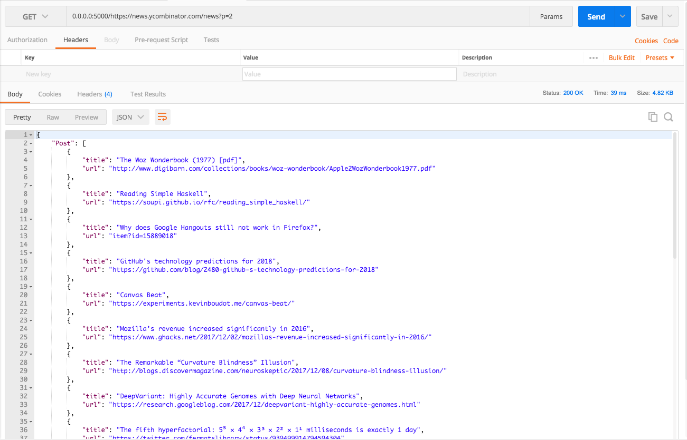

# Toapi

Every web site provides APIs.

[](https://travis-ci.org/gaojiuli/toapi)
[](https://pypi.python.org/pypi/toapi/)
[](https://pypi.python.org/pypi/toapi/)
[](https://pypi.python.org/pypi/toapi/)


## Overview

Toapi is a **clever**, **simple** and **fast** library letting any 
web site provide APIs. In the past, we crawl data and storage them and create 
api service to share them maybe we should also update them regularly. 
This library make things easy. The only thing you should do is defining your data, 
they would be shared as api service automatically.

Documentation: [Toapi Documentation](http://www.toapi.org)

## Code Snippets:

```python
from toapi import XPath, Item, Api
from toapi import Settings

class MySettings(Settings):
    web = {
        "with_ajax": False
    }

api = Api('https://news.ycombinator.com/', settings=MySettings)

class Post(Item):
    url = XPath('//a[@class="storylink"]/@href')
    title = XPath('//a[@class="storylink"]/text()')

    class Meta:
        source = XPath('//tr[@class="athing"]')
        route = {'/news?page=:page':'/news?p=:page'}

class Page(Item):
    next_page = XPath('//a[@class="morelink"]/@href')

    class Meta:
        source = None
        route = {'/news?page=:page':'/news?p=:page'}

    def clean_next_page(self, next_page):
        return "http://127.0.0.1:5000/" + str(next_page)

api.register(Post)
api.register(Page)

api.serve()

# Visit: http://127.0.0.1:5000/_meta
```

## Diagram

[](https://asciinema.org/a/shet2Ba9d4muCbZ6C3f56EbAt)





- Sending only one request to source web site with the same url.
- Most of the data fetched from cache and storage.
- Getting HTML from storage when the cache expired.
- Getting HTML from source site when the storage expired.

## Get Started

### Installation

```text
$ pip install toapi
$ toapi -v
toapi, version 0.1.12
```

### New Project

```text
$ toapi new api
2017/12/14 09:16:54 [New project] OK Creating project directory "api" 
Cloning into 'api'...
remote: Counting objects: 10, done.
remote: Compressing objects: 100% (8/8), done.
remote: Total 10 (delta 1), reused 10 (delta 1), pack-reused 0
Unpacking objects: 100% (10/10), done.
Checking connectivity... done.
2017/12/14 09:16:56 [New project] OK Success! 

     cd api
     toapi run

```

### Run

In the directory of 'api' created above. Run the command line as follows.

```text
$ toapi run
2017/12/14 09:27:18 [Serving ] OK http://127.0.0.1:5000
```

Then, everything is done. Visit http://127.0.0.1:5000 in your browser!

### Deploy

A Toapi app is a flask app. So you can deploy it as follows:


> While lightweight and easy to use, Flask’s built-in server is not suitable for production as it doesn’t scale well and by default serves only one request at a time. Some of the options available for properly running Flask in production are documented here.

> If you want to deploy your Flask application to a WSGI server not listed here, look up the server documentation about how to use a WSGI app with it. Just remember that your Flask application object is the actual WSGI application.

[Deployment Options &#8212; Flask Documentation (0.12)](http://flask.pocoo.org/docs/0.12/deploying/)

## Screenshots

### Running Log



### Running Items



### Running Status



### Running Results



## Features

### Multiple caching

Toapi use cache to prevent repeated parsing and use storage to prevent sending request.

### Multiple sites

A toapi app has an ability to gather pages of multiple websites and convert them to easy to use APIs

### Multiple Templates & Applications

Any application created by toapi could be shared to others.

### Easy to deploy.

A toapi app is a standard flask app, so that you can deploy your app as deploying a flask app.

### Status Monitor

A toapi app will automatically count kinds of states of itself and you can visit the states whenever you want.

## Getting help

To get help with Toapi, please use the [GitHub issues]

[GitHub issues]: https://github.com/gaojiuli/toapi/issues
[GitHub project pages]: https://help.github.com/articles/creating-project-pages-manually/
[pip]: http://pip.readthedocs.io/en/stable/installing/
[Python]: https://www.python.org/

## Todo

1. Checking system every time running the app.
2. Collecting all awesome Toapi project.

## Donate

[BTC(0.005)](https://blockchain.info/payment_request?address=18QChGWtGWAQyXKQVmnpKf7pdm7mYxoYTQ&amount=0.005&message=For%20Github%20Projects.)