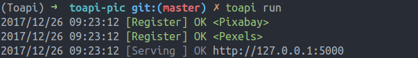
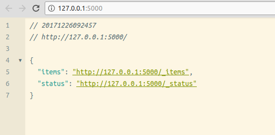
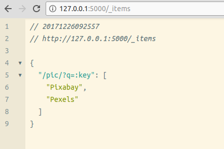
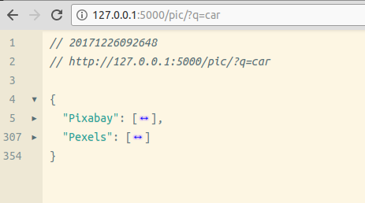

## Aim

Our aim is to build an api server that provides free pictures. Those pictures are fetched from those websites:

- [https://pixabay.com/](https://pixabay.com/)
- [https://www.pexels.com/](https://www.pexels.com/)

You can find the source code in [examples/toapi-pic](https://github.com/gaojiuli/toapi/blob/master/examples/toapi-pic)

## What it look like?

### Running

### Index

### Items

### Results

