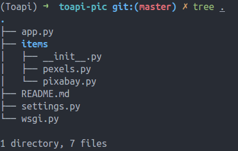

## New Project

You can run the command 'toapi new' whenever you want to start a new api server.

```text
toapi new toapi/toapi-pic
```

This command create a new folder named `toapi-pic`, which include some files:



- app.py: define the app instance.
- settings.py: global configs.
- items: define items you want to extract.
- wsgi.py: expose interface to gunicorn, uwsgi .etc for serving.